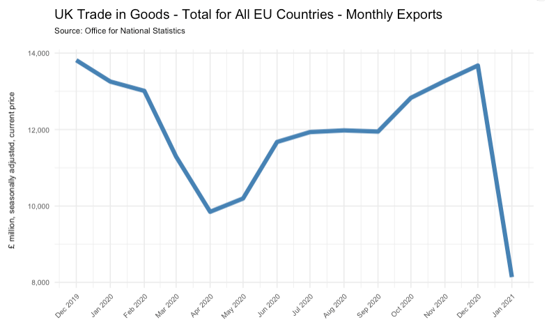
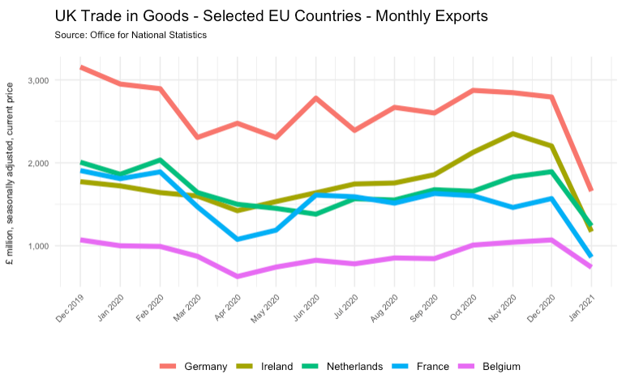

# UK exports to the EU

This uses UK Office for National Statistics data published on  12th March 2021, available at the link below:

https://www.ons.gov.uk/economy/nationalaccounts/balanceofpayments/datasets/uktradeallcountriesseasonallyadjusted

The most recent period covered by this data in January 2021, giving us the first published figures after the Brexit withdrawal agreement came into effect.

 

## Total exports to all EU countries

Figures to note:

* Jan 2020:	£13,256 million
* Dec 2020:	£13,676 million
* Jan 2021:	£8,138 million

 

 

## Exports to selected EU countries

### Notes on this report

The workings behind the plots are saved in the file `analysis/uk_to_eu_exports_jan_2021` (available in .Rmd and HTML formats).

 

The report uses data on UK exports from this Excel file:

https://www.ons.gov.uk/file?uri=/economy/nationalaccounts/balanceofpayments/datasets/uktradeallcountriesseasonallyadjusted/current/allcountriesjan2021final.xlsx

I have copied the EU data from the *Monthly Exports* tab into a separate csv saved in the `data_raw` folder, which is the one I'm using for the plots.

The full Excel file is also saved for reference in the `data_raw` folder.
